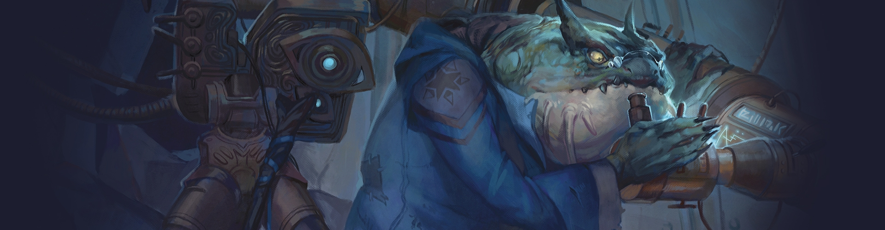

# Engine Prototyping

This is an experimental repository for documenting requirements, taking notes, and prototyping ideas for a rules engine using my experiences from creating [Aurora](https://www.aurorabuilder.com).

The idea is that the engine could support multiple game systems (e.g. dungeons & dragons, pathfinder, call of cthulhu)

- Engine & System Configuration
- Building Blocks
- Multiple Data Providers (e.g. JSON/XML/SQL/CUSTOM)
- Extensibility
- Customization
- Cross Platform, C# .NET 6

&nbsp;

_These are all just idea's for prototyping, there are no guarantees here._

&nbsp;

## Implementation

You should be able to create your own implementations for the abstractions of the engine to support the game system of your choice when the default implementation is not suitable for the system. (e.g. a statistics calulator or equipment sheet generator)

- **Example:** You can create a class called `PathfinderDocumentGenerator` that implements the `IDocumentGenerator` to override the behavior used to generate a character sheet for your character.
    - In your engine setup you can then register the `PathfinderDocumentGenerator` to be used when an instance of the `IDocumentGenerator` is created.

&nbsp;

## Notes

_placeholder_
